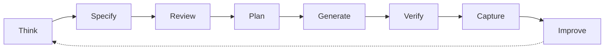
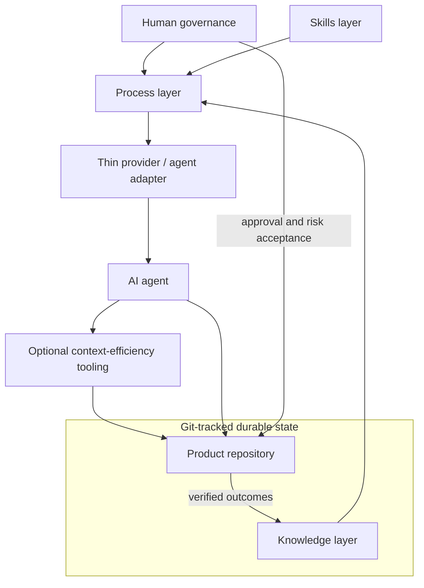

# FedrBodr AI Framework

Build AI-first engineering workflows that outlive any single LLM provider.

> **Status:** Early-stage, experimental, and a work in progress. Version 0.1 is a documentation-first engineering methodology, evolving specification, and set of project templates—not a finished software platform.

FedrBodr AI Framework asks a practical question:

> How do we build an engineering process in which AI becomes a reliable member of the engineering team?

AI makes implementation cheap. Engineering remains essential. The cost of writing code has collapsed; the cost of mistakes, insecure design, incorrect assumptions, operational failures, and long-term maintenance has not.

## Manifesto

> AI providers are temporary.
>
> Knowledge is permanent.
>
> Git is the source of truth.
>
> Architecture outlives every model.

The framework organizes work so AI helps produce secure, maintainable, verifiable, cost-aware, and evolvable software. It adapts established engineering practices to an environment where implementation can be generated quickly. Read the full [Manifesto](docs/MANIFESTO.md).

## What this is—and is not

This is a provider-neutral engineering methodology. It connects durable project knowledge, a risk-proportional process, portable engineering skills, human governance, verification evidence, and replaceable AI tools.

It is not a prompt collection, personal knowledge base, model-specific configuration, replacement for software engineering, agent runtime, or finished platform. A provider's chat history is ephemeral working context, not project memory. Prompts help execute work; they do not replace requirements, architecture, decisions, tests, or review.

## Engineering lifecycle

No meaningful implementation begins before a sufficient specification exists and receives the required human approval. For a small, low-risk change, the specification and review may be a short design note. Proportionality reduces ceremony, not reasoning.



The extended lifecycle covers problem framing, discovery, requirements, specification, engineering review, human approval, planning, TDD implementation, review, verification, release, knowledge capture, and improvement. See the [Engineering Lifecycle](docs/ENGINEERING-LIFECYCLE.md).

## Architecture

The methodology separates four independent layers. Project knowledge does not live in skills or provider adapters; process does not depend on one agent product.



- **Knowledge:** what the project knows—requirements, architecture, constraints, decisions, plans, risks, and operational context.
- **Process:** how work moves through specification, approval, implementation, verification, release, and learning.
- **Skills:** provider-portable methods for architecture, TDD, threat modeling, debugging, review, and other engineering work.
- **Provider and agent adapters:** thin entry points for Codex, Claude Code, Cursor, Gemini, OpenCode, Copilot, local models, and future tools.

Security and expected load are design inputs before architecture approval. Cross-cutting dimensions also include privacy, reliability, observability, maintainability, testability, operability, cost, compliance, accessibility where applicable, and context efficiency. See [Architecture](docs/ARCHITECTURE.md) and [Engineering Dimensions](docs/ENGINEERING-DIMENSIONS.md).

## Core rules

- Engineering before generation; specification and review before implementation.
- Generated code is untrusted until verified with evidence.
- Humans own business intent, material risk, and consequential decisions.
- Security is cross-cutting, not a final checklist.
- Expected load and explicit assumptions shape architecture.
- Process depth is proportional to risk.
- Tests, documentation, and decisions are part of the product.
- AI adapts to the project; durable knowledge returns to Git.
- Preserve signal and reduce context waste: compress noise, not evidence.

See [Principles](docs/PRINCIPLES.md) and [Governance](docs/GOVERNANCE.md).

## Repository structure

```text
docs/                         Methodology, architecture, lifecycle, and decisions
docs/integrations/            Optional, independently owned integration targets
templates/project/            Provider-neutral adoption template
AGENTS.md                     Rules for agents changing this framework
```

## Getting started

1. Copy `templates/project/AGENTS.md` and `templates/project/docs/ai` into a product repository.
2. Record verified context and architecture, including security and load assumptions.
3. Classify the first task by risk and write a proportionate specification.
4. Review and obtain the required human approval before implementation.
5. Use any suitable AI provider, verify the result, and return durable findings to Git.

There is no installation command or framework runtime in version 0.1. Start with the [project template guide](templates/project/README.md).

## Optional integration targets

[Superpowers](https://github.com/obra/superpowers) is a candidate workflow and skills implementation for parts of the Process and Skills layers. [RTK](https://github.com/rtk-ai/rtk) is a candidate Context Efficiency tool for compacting low-signal command output. Neither is required, bundled, or claimed as officially integrated or tested with this framework. See [Superpowers integration notes](docs/integrations/superpowers.md) and [RTK integration notes](docs/integrations/rtk.md).

## Current scope and roadmap

Version 0.1 defines a methodology, terminology, ADRs, and templates. It does not implement a CLI, agent runtime, MCP server, RAG system, vector database, skill package manager, or executable provider adapter. See the [Roadmap](docs/ROADMAP.md).

FedrBodr OS is a separate project and may become a future reference implementation. This repository contains neither FedrBodr OS content nor personal data.

## Contributing and license

Read [Contributing](CONTRIBUTING.md), the [Code of Conduct](CODE_OF_CONDUCT.md), [Security Policy](SECURITY.md), and [agent guidance](AGENTS.md). Licensed under the [Apache License 2.0](LICENSE).
