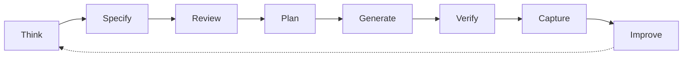
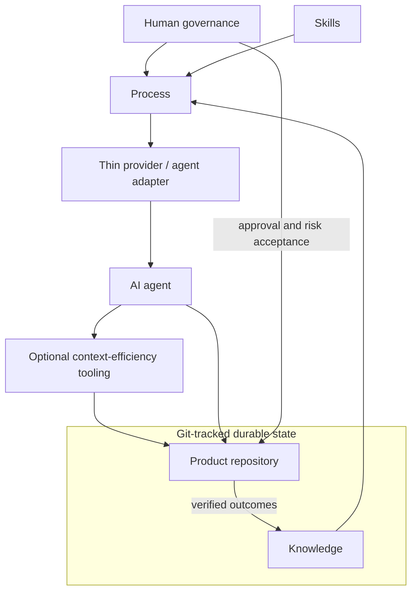

# FedrBodr AI Framework

[English](README.md) | [Русский](README.ru.md)

Build AI-first engineering workflows that outlive any single LLM provider.

> **Status:** Early-stage and experimental. Version 0.1 is a documentation-first methodology and project template—not a software platform.

> How do we make AI a reliable member of the engineering team?

AI makes implementation cheap. Engineering remains essential: mistakes, insecure design, false assumptions, outages, and maintenance are still expensive.

## Manifesto

> AI providers are temporary.<br>
> Knowledge is permanent.<br>
> Git is the source of truth.<br>
> Architecture outlives every model.

Read the [Manifesto](docs/MANIFESTO.md).

## What it is

FedrBodr AI Framework is a provider-neutral engineering methodology. It connects durable project knowledge, a risk-proportional process, portable skills, human governance, verification evidence, and replaceable AI tools.

It is not a prompt collection, personal knowledge base, model configuration, agent runtime, or substitute for software engineering. Provider chat history is working context, not project memory. Requirements, architecture, decisions, tests, and verified outcomes belong in Git.

## Lifecycle

Meaningful implementation requires a sufficient specification and approval by the decision owner. Low-risk work may use one short design note; proportionality reduces ceremony, not reasoning.



See the [Engineering Lifecycle](docs/ENGINEERING-LIFECYCLE.md).

## Architecture



The four independent layers are **Knowledge** (what the project knows), **Process** (how work is governed), **Skills** (how work is performed), and **Provider/Agent Adapters** (how replaceable tools enter the system). Security and expected load shape architecture before approval. See [Architecture](docs/ARCHITECTURE.md) and [Engineering Dimensions](docs/ENGINEERING-DIMENSIONS.md).

## Core rules

- Engineer before generating; specify and review before implementing.
- Treat generated code as untrusted until evidence verifies it.
- Keep consequential decisions and risk acceptance with accountable people.
- Make security and expected load design inputs.
- Scale process depth with risk.
- Return changed knowledge to Git.
- Compress noise, not evidence.

See [Principles](docs/PRINCIPLES.md) and [Governance](docs/GOVERNANCE.md).

## Getting started

1. Copy `templates/project/AGENTS.md` and `templates/project/docs/ai` into a product repository.
2. Record verified context, architecture, security constraints, and load assumptions.
3. Classify the task and write a proportionate specification.
4. Review it and obtain approval from the decision owner.
5. Implement with any suitable provider, verify the result, and update durable knowledge.

There is no install command or runtime. Start with the [project template](templates/project/README.md).

## Repository

```text
docs/                         Canonical methodology and decisions in English
docs/integrations/            Optional independent integration targets
docs/ru/                      Russian translations of the core methodology
templates/project/            Provider-neutral adoption template
```

[Superpowers](https://github.com/obra/superpowers) is an optional Process/Skills candidate. [RTK](https://github.com/rtk-ai/rtk) is an optional Context Efficiency candidate. Neither is required, bundled, or claimed as officially integrated or tested. See the [integration notes](docs/integrations/).

Version 0.1 defines methodology, terminology, ADRs, and templates. It does not implement a CLI, agent runtime, MCP server, RAG system, vector database, skills package manager, or provider adapter. See the [Roadmap](docs/ROADMAP.md).

FedrBodr OS is a separate project and possible future reference implementation.

## Contributing and license

Read [Contributing](CONTRIBUTING.md), the [Code of Conduct](CODE_OF_CONDUCT.md), [Security Policy](SECURITY.md), and [agent guidance](AGENTS.md). Licensed under [Apache 2.0](LICENSE).
