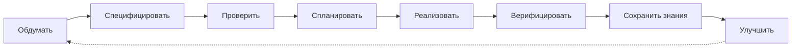
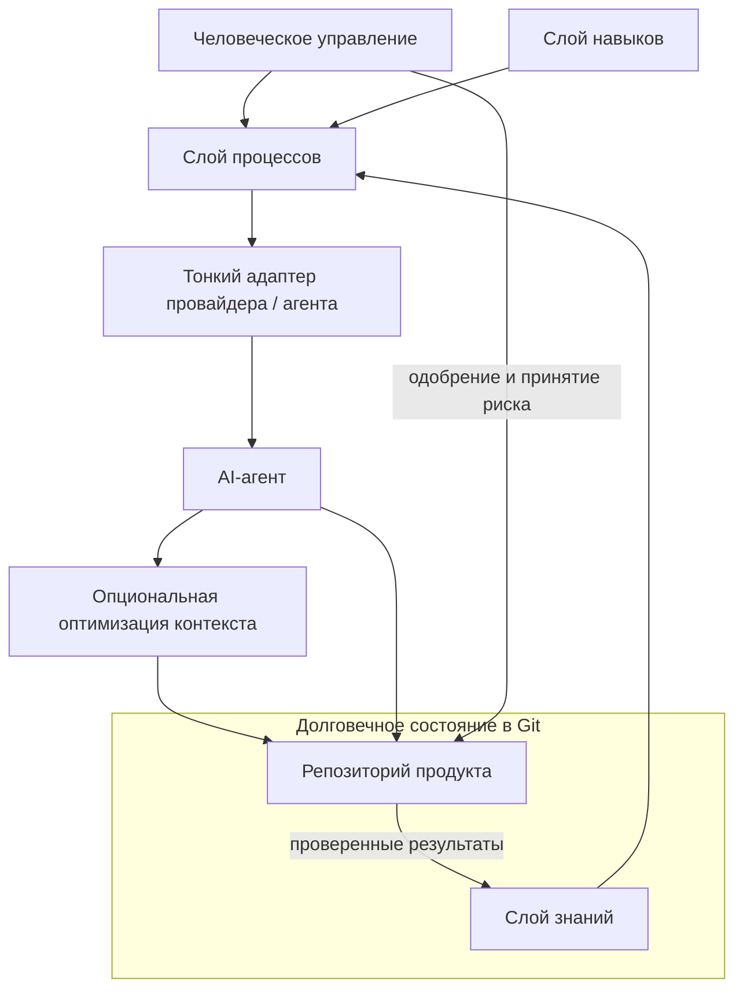

# FedrBodr AI Framework

[English](README.md) | [Русский](README.ru.md)

Создавайте AI-first инженерные процессы, которые переживут любого отдельного LLM-провайдера.

> **Статус:** ранняя экспериментальная стадия, работа продолжается. Версия 0.1 — это documentation-first инженерная методология, развивающаяся спецификация и набор проектных шаблонов, а не готовая программная платформа.

FedrBodr AI Framework отвечает на практический вопрос:

> Как построить инженерный процесс, в котором AI становится надёжным участником инженерной команды?

AI удешевляет реализацию. Инженерия остаётся необходимой. Стоимость написания кода резко снизилась; стоимость ошибок, небезопасного проектирования, неверных предположений, эксплуатационных сбоев и долгосрочного сопровождения — нет.

## Манифест

> AI-провайдеры временны.
>
> Знания постоянны.
>
> Git — источник истины.
>
> Архитектура переживёт любую модель.

Методология организует работу так, чтобы AI помогал создавать безопасное, сопровождаемое, проверяемое, учитывающее стоимость и развиваемое ПО. Она адаптирует сложившиеся инженерные практики к среде, где реализация может генерироваться быстро. См. полный [Манифест](docs/ru/MANIFESTO.md).

## Что это — и чем это не является

Это независимая от провайдера инженерная методология. Она объединяет долговечные знания проекта, процесс соразмерный риску, переносимые инженерные навыки, человеческое управление, свидетельства проверки и заменяемые AI-инструменты.

Это не коллекция промптов, не персональная база знаний, не конфигурация конкретной модели, не замена программной инженерии, не agent runtime и не готовая платформа. История чатов провайдера — временный рабочий контекст, а не память проекта. Промпты помогают выполнять работу, но не заменяют требования, архитектуру, решения, тесты и review.

## Инженерный жизненный цикл

Содержательная реализация не начинается до появления достаточной спецификации и необходимого человеческого одобрения. Для небольшого изменения с низким риском спецификацию и review можно объединить в короткой design note. Соразмерность уменьшает церемонию, но не исключает рассуждение.



Расширенный жизненный цикл охватывает постановку проблемы, исследование, требования, спецификацию, инженерное review, человеческое одобрение, планирование, TDD-реализацию, review, верификацию, релиз, сохранение знаний и улучшение. См. [Инженерный жизненный цикл](docs/ru/ENGINEERING-LIFECYCLE.md).

## Архитектура

Методология разделяет четыре независимых слоя. Знания проекта не живут в skills или provider adapters; процесс не зависит от одного агентского продукта.



- **Знания:** что проект знает — требования, архитектура, ограничения, решения, планы, риски и эксплуатационный контекст.
- **Процесс:** как работа проходит через спецификацию, одобрение, реализацию, верификацию, релиз и обучение.
- **Навыки:** переносимые между провайдерами методы архитектуры, TDD, threat modeling, отладки, review и другой инженерной работы.
- **Адаптеры провайдеров и агентов:** тонкие точки входа для Codex, Claude Code, Cursor, Gemini, OpenCode, Copilot, локальных моделей и будущих инструментов.

Безопасность и ожидаемая нагрузка являются входными данными проектирования до одобрения архитектуры. К сквозным аспектам также относятся privacy, reliability, observability, maintainability, testability, operability, стоимость, compliance, accessibility при необходимости и эффективность контекста. См. [Архитектуру](docs/ru/ARCHITECTURE.md) и [Инженерные аспекты](docs/ru/ENGINEERING-DIMENSIONS.md).

## Основные правила

- Инженерия до генерации; спецификация и review до реализации.
- Сгенерированный код не считается доверенным до подтверждения проверяемыми свидетельствами.
- Люди отвечают за бизнес-намерение, существенный риск и значимые решения.
- Безопасность — сквозной аспект, а не финальный checklist.
- Ожидаемая нагрузка и явные предположения формируют архитектуру.
- Глубина процесса пропорциональна риску.
- Тесты, документация и решения являются частью продукта.
- AI адаптируется к проекту; долговечные знания возвращаются в Git.
- Сохраняйте сигнал и уменьшайте контекстный шум: сжимайте шум, а не свидетельства.

См. [Принципы](docs/ru/PRINCIPLES.md) и [Управление](docs/ru/GOVERNANCE.md).

## Структура репозитория

```text
docs/                         Каноническая методология на английском
docs/integrations/            Опциональные независимые integration targets
docs/ru/                      Русский перевод основной методологии
templates/project/            Provider-neutral шаблон внедрения
AGENTS.md                     Правила для агентов, изменяющих framework
```

## Начало работы

1. Скопируйте `templates/project/AGENTS.md` и `templates/project/docs/ai` в репозиторий продукта.
2. Зафиксируйте проверенный контекст и архитектуру, включая предположения о безопасности и нагрузке.
3. Классифицируйте первую задачу по риску и напишите соразмерную спецификацию.
4. Проведите review и получите необходимое человеческое одобрение до реализации.
5. Используйте подходящего AI-провайдера, проверьте результат и верните долговечные знания в Git.

В версии 0.1 нет команды установки или framework runtime. Начните с [руководства по проектному шаблону](templates/project/README.md), которое пока поддерживается на английском.

## Опциональные integration targets

[Superpowers](https://github.com/obra/superpowers) рассматривается как кандидат для реализации частей слоёв Process и Skills. [RTK](https://github.com/rtk-ai/rtk) рассматривается как инструмент Context Efficiency для сжатия малосигнального вывода команд. Они не обязательны, не поставляются с framework, и официальная или протестированная интеграция не заявляется. Подробные integration notes пока поддерживаются на английском: [Superpowers](docs/integrations/superpowers.md) и [RTK](docs/integrations/rtk.md).

## Текущая область и roadmap

Версия 0.1 определяет методологию, терминологию, ADR и шаблоны. Она не реализует CLI, agent runtime, MCP server, RAG-систему, vector database, менеджер пакетов skills или исполняемый provider adapter. См. [Roadmap](docs/ru/ROADMAP.md).

FedrBodr OS — отдельный проект, который может стать будущей reference implementation. Этот репозиторий не содержит ни материалов FedrBodr OS, ни персональных данных.

## Участие и лицензия

Нормативные документы [Contributing](CONTRIBUTING.md), [Code of Conduct](CODE_OF_CONDUCT.md), [Security Policy](SECURITY.md) и [инструкции для агентов](AGENTS.md) пока поддерживаются на английском. Проект распространяется по [Apache License 2.0](LICENSE).

Правила и статус перевода описаны в [Localization Policy](docs/LOCALIZATION.md).
