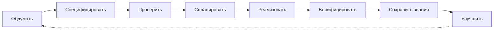
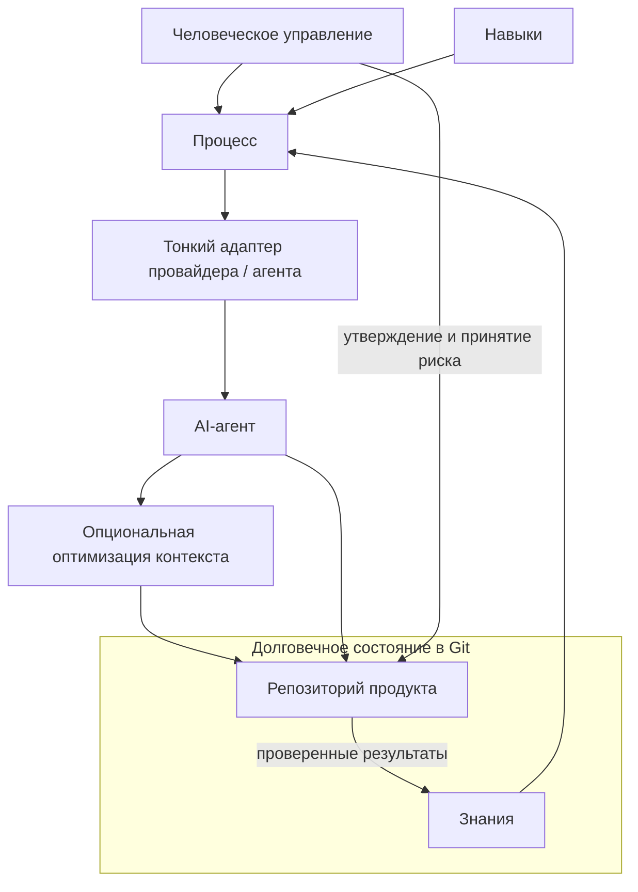

# FedrBodr AI Framework

[English](README.md) | [Русский](README.ru.md)

Создавайте AI-first инженерные процессы, которые переживут любого LLM-провайдера.

> **Статус:** ранняя экспериментальная стадия. Версия 0.1 — documentation-first методология и проектный шаблон, а не программная платформа.

> Как сделать AI надёжным участником инженерной команды?

AI удешевляет реализацию. Инженерия остаётся необходимой: ошибки, небезопасный дизайн, неверные предположения, сбои и сопровождение по-прежнему дороги.

## Манифест

> AI-провайдеры временны.<br>
> Знания постоянны.<br>
> Git — источник истины.<br>
> Архитектура переживёт любую модель.

Читайте полный [Манифест](docs/ru/MANIFESTO.md).

## Что это

FedrBodr AI Framework — provider-neutral инженерная методология. Она объединяет долговечные знания проекта, процесс соразмерный риску, переносимые skills, человеческое управление, evidence и заменяемые AI-инструменты.

Это не коллекция промптов, не персональная база знаний, не конфигурация модели, не agent runtime и не замена программной инженерии. История чатов — рабочий контекст, а не память проекта. Требования, архитектура, решения, тесты и проверенные результаты должны храниться в Git.

## Жизненный цикл

Содержательная реализация требует достаточной спецификации и утверждения владельцем решения. Для Low Risk достаточно короткой design note: соразмерность уменьшает церемонию, но не исключает рассуждение.



См. [Инженерный жизненный цикл](docs/ru/ENGINEERING-LIFECYCLE.md).

## Архитектура



Четыре независимых слоя: **Knowledge** (что знает проект), **Process** (как принимаются решения), **Skills** (как выполняется работа) и **Provider/Agent Adapters** (как подключаются заменяемые инструменты). Безопасность и ожидаемая нагрузка влияют на архитектуру до её утверждения. См. [Архитектуру](docs/ru/ARCHITECTURE.md) и [Инженерные аспекты](docs/ru/ENGINEERING-DIMENSIONS.md).

## Основные правила

- Инженерия до генерации; спецификация и review до реализации.
- Сгенерированный код не считается доверенным без evidence.
- Значимые решения и принятие риска остаются у ответственных людей.
- Безопасность и ожидаемая нагрузка — входные данные дизайна.
- Глубина процесса пропорциональна риску.
- Изменившиеся знания возвращаются в Git.
- Сжимайте шум, а не свидетельства.

См. [Принципы](docs/ru/PRINCIPLES.md) и [Управление](docs/ru/GOVERNANCE.md).

## Начало работы

1. Скопируйте `templates/project/AGENTS.md` и `templates/project/docs/ai` в репозиторий продукта.
2. Зафиксируйте контекст, архитектуру, ограничения безопасности и предположения о нагрузке.
3. Классифицируйте риск и напишите соразмерную спецификацию.
4. Проведите review и получите утверждение владельца решения.
5. Реализуйте с любым подходящим провайдером, проверьте результат и обновите долговечные знания.

Команды установки и runtime нет. Начните с [проектного шаблона](templates/project/README.md).

## Репозиторий

```text
docs/                         Каноническая методология и решения на английском
docs/integrations/            Опциональные независимые integration targets
docs/ru/                      Русский перевод основной методологии
templates/project/            Provider-neutral шаблон внедрения
```

[Superpowers](https://github.com/obra/superpowers) — опциональный кандидат для Process/Skills. [RTK](https://github.com/rtk-ai/rtk) — опциональный кандидат для Context Efficiency. Они не обязательны, не поставляются с framework, а официальная или протестированная интеграция не заявляется. См. [integration notes](docs/integrations/).

Версия 0.1 определяет методологию, терминологию, ADR и шаблоны. Она не реализует CLI, agent runtime, MCP server, RAG, vector database, skills package manager или provider adapter. См. [Roadmap](docs/ru/ROADMAP.md).

FedrBodr OS — отдельный проект и возможная будущая reference implementation.

## Участие и лицензия

Читайте [Contributing](CONTRIBUTING.md), [Code of Conduct](CODE_OF_CONDUCT.md), [Security Policy](SECURITY.md) и [инструкции для агентов](AGENTS.md). Лицензия — [Apache 2.0](LICENSE). Правила перевода — в [Localization Policy](docs/LOCALIZATION.md).
