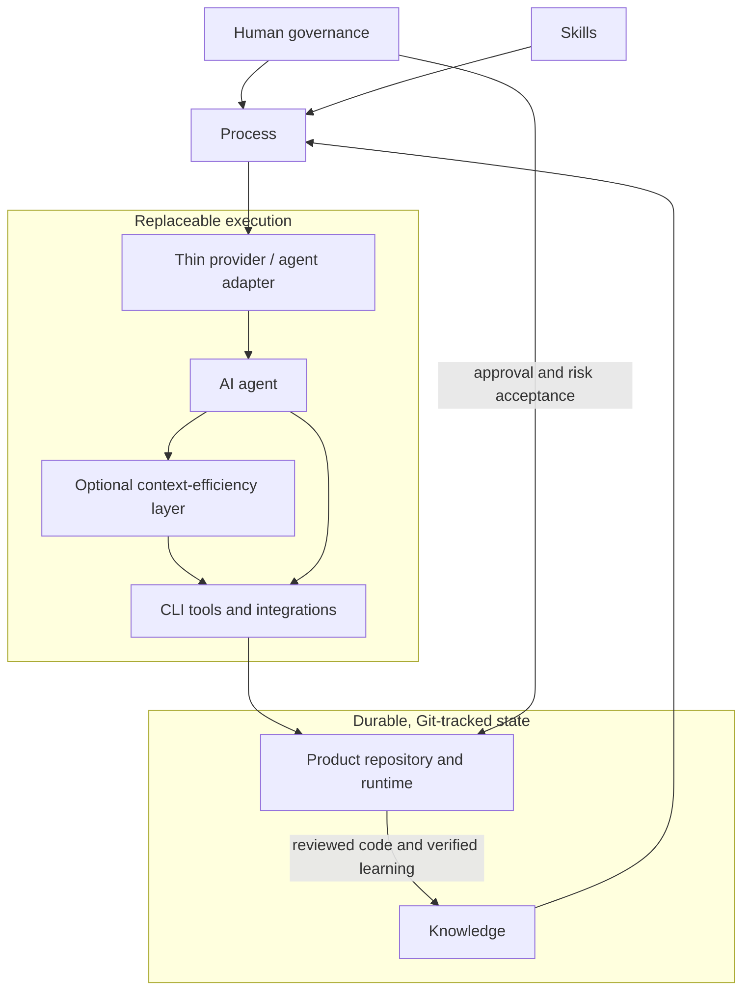

# Conceptual Reference Architecture

## Status

This document defines conceptual responsibilities and dependency rules for the evolving methodology. It does not describe implemented framework software.

## Human governance

Human governance sits above the technical layers. People define business intent, approve consequential decisions, set acceptable risk and security levels, accept cost commitments, and authorize high-risk releases. AI assists but does not inherit accountability.

## Four independent layers

### Layer 1 — Knowledge

The Knowledge layer records what the project knows: product and business context, requirements, architecture, constraints, decisions, roadmap, domain and operational knowledge, active context, known risks, and assumptions. It is durable, Git-tracked, portable, and provider-neutral.

### Layer 2 — Process

The Process layer defines how work and decisions move through discovery, requirements, specification, engineering review, security and load analysis, planning, human approval, TDD, implementation, review, verification, release, documentation, and knowledge capture. Security is cross-cutting across these activities, not a single late stage.

### Layer 3 — Skills

The Skills layer defines how to perform a class of work: brainstorming, architecture, specification writing, planning, TDD, systematic debugging, threat modeling, security review, performance analysis, code review, verification, documentation, and release engineering. A skill contains method, not project-specific knowledge.

### Layer 4 — Provider and Agent Adapters

Thin adapters explain how Codex, Claude Code, Cursor, Gemini, OpenCode, Copilot, local models, or future tools enter the system. They may define startup instructions, tool-specific behavior, supported integration mechanisms, and how to locate the provider-neutral project entry point. They must not duplicate architecture, business context, roadmap, decisions, specifications, or requirements.

## Dependency rules

- Process consumes Knowledge and selects Skills; neither depends on a provider's private memory.
- Adapters depend on stable, provider-neutral entry points. Core documents do not depend on adapters.
- Agents and tools may propose repository changes. Only validated outcomes return to durable state.
- Context optimization stays outside the durable core. Original files, Git history, test reports, and logs remain authoritative.
- A product repository adopts the methodology but does not require this framework repository at runtime.

## Security, load, and engineering dimensions

Specification and architecture review apply the relevant [Engineering Dimensions](ENGINEERING-DIMENSIONS.md). Security affects every lifecycle stage. Expected users, normal and peak traffic, concurrency, throughput, data volume and growth, latency, availability, recovery, deployment environment, infrastructure constraints, and cost are recorded or explicitly marked unknown before architecture approval.

## Skills architecture direction

A future skills library may classify skills as `universal`, `architecture`, `security`, `testing`, `workflows`, `languages`, `frameworks`, and `operations`. No empty directories or package manager are created in version 0.1. Skills must remain free of project-specific knowledge. Third-party skills require transparent provenance, version, and license; integrations may not silently override governance.

## Replaceable-provider example

A team records context, an approved specification, architecture, ADRs, and verification evidence in Git while using Claude Code. It then gives Codex the same provider-neutral entry point and replaces only tool-specific startup instructions. No engineering knowledge is migrated. Codex works against the same approved artifacts and returns reviewed outcomes to the same repository.
