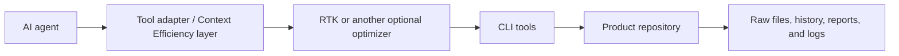

# RTK Integration Target

## Status

Candidate optional Context Efficiency integration. It is neither installed nor required, and it is not bundled, tested, or officially integrated with FedrBodr AI Framework.

## What RTK is

[RTK](https://github.com/rtk-ai/rtk) is an independent project maintained under the `rtk-ai` GitHub organization. It is a CLI proxy designed to filter and compact command output before it enters an AI agent's context. Its upstream documentation describes filters for Git, file listing and reading, search, tests, linters, builds, containers, infrastructure tools, and logs.

RTK is not part of the framework core. Its implementation is not copied or vendored here. Reported token savings are upstream measurements, not guarantees by this project; results vary with the repository, command, output, integration mechanism, tool behavior, and workflow.

## Why context efficiency matters

Verbose, repetitive output consumes human attention and model context and may increase token-based operating cost. A suitable output optimizer can make common successful commands easier to inspect while keeping important detail reachable.



Conceptually:

**RTK → Tool Output Optimization → Context Efficiency → Reduced Token Waste → Lower Potential AI Operating Cost**

Potential cost reduction is an outcome to measure, not a promised saving.

## Relationship to Codex and other agents

Upstream RTK documentation describes different integration mechanisms for several agent tools. For Codex, it currently documents initialization that adds instruction-based guidance:

```bash
rtk init -g --codex
```

This command has **not** been executed for this repository. Consult current upstream documentation before installation; initialization may write agent configuration. Other tools may use hooks, plugins, or instruction files, each with different interception and fallback behavior.

## Proposed usage

If independently adopted, use RTK selectively for understood, high-volume commands where compact output retains the information needed for the task. Record the tool version and configuration, compare behavior with raw commands, and make bypass or raw passthrough easy. RTK remains outside durable knowledge and verification authority.

## Safety considerations

- Preserve failing tests, stack traces needed for diagnosis, security findings, meaningful warnings, behavioral changes, unresolved errors, and acceptance evidence.
- Do not treat compact output as complete evidence when omitted detail could change a decision.
- Avoid compression for unfamiliar output, incident response, destructive operations, forensic work, exact-format checks, or security-sensitive review unless raw output is retained and inspected.
- Review configuration and telemetry behavior against project security and privacy requirements.
- Keep original source files, Git history, test reports, logs, and other primary evidence authoritative.

## Raw-output fallback

The workflow must provide a direct way to rerun a command without filtering or retrieve retained full output. Upstream RTK documents raw passthrough and full-output retention options, but adopters must validate them for their selected version and agent integration. If fallback is missing, stale, or unclear, use the original command and preserve its output directly.

## Limitations

- Filtering can omit context that later proves material.
- Agent integrations differ; instruction-based use depends on agent compliance.
- Output formats and supported commands can change between versions.
- Token reduction does not establish correctness, completeness, or lower total cost.
- Context compression cannot replace focused tasks, good context architecture, durable documentation, or verification.

## Current integration status

Only this conceptual integration note exists. No RTK dependency, configuration, hook, generated instruction, compatibility test, or performance measurement has been added.

## Attribution sources

- [RTK repository and README](https://github.com/rtk-ai/rtk)
- [RTK supported-agent documentation](https://github.com/rtk-ai/rtk/blob/master/docs/guide/getting-started/supported-agents.md)

Source claims were reviewed on 2026-07-13. Upstream documentation remains authoritative for RTK itself.
