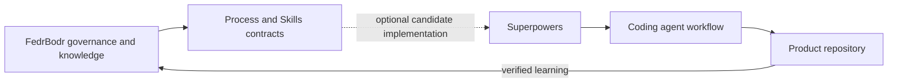

# Superpowers Integration Target

## Status

Candidate optional integration. It is not required, bundled, tested, or officially integrated with FedrBodr AI Framework.

## What Superpowers is

[Superpowers](https://github.com/obra/superpowers) is an independent, MIT-licensed software-development methodology and composable skills framework for coding agents. It is created by Jesse Vincent and contributors and maintained outside this project. Its documented workflow includes brainstorming before implementation, written design approval, implementation planning, Git worktrees, red–green TDD, subagent-driven or plan-driven execution, code review, and verification before branch completion.

No Superpowers skill or documentation is copied into this repository. Users must review the upstream repository, current version, license, installation instructions, and security implications before adoption.

## Conceptual relationship

> Superpowers provides an executable workflow for coding agents. FedrBodr AI Framework defines the broader engineering system in which project knowledge, workflows, skills, human governance, verification evidence, and replaceable AI providers work together.

Superpowers is a candidate implementation for parts of the **Process** and **Skills** layers. FedrBodr AI Framework additionally defines durable project knowledge, provider-neutral boundaries, risk governance, engineering dimensions, security and expected load as design inputs, cost and context concerns, human decision boundaries, and a knowledge lifecycle.

## Proposed usage

A project could independently install Superpowers for a supported agent and map its design, planning, TDD, review, and verification workflows to the project's approved specifications and governance gates. Project instructions remain authoritative. Integration must not copy project knowledge into skills or let a tool silently approve risk, design, or release decisions.

## Limitations and open validation

- Compatibility with this framework has not been tested.
- Upstream workflows, supported agents, file locations, and behavior may change.
- Superpowers may apply stronger or different workflow rules than a project's risk model; conflicts require explicit human resolution.
- Installation and updates create a separate third-party dependency relationship.
- A future evaluation should test specification handoff, decision owner boundaries, evidence preservation, and knowledge updates across at least two providers.

## Attribution sources

- [Superpowers repository and README](https://github.com/obra/superpowers)
- [Superpowers license](https://github.com/obra/superpowers/blob/main/LICENSE)

Source claims were reviewed on 2026-07-13. Upstream documentation remains authoritative for Superpowers itself.
