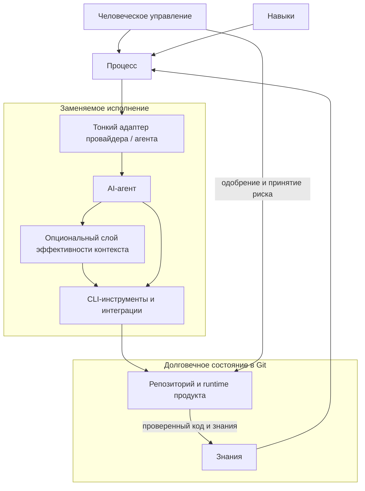

# Концептуальная референсная архитектура

[English source](../ARCHITECTURE.md) | Русский

> **Статус перевода:** актуален. Каноническим является [английский оригинал](../ARCHITECTURE.md).

## Статус

Документ определяет концептуальные зоны ответственности и правила зависимостей развивающейся методологии. Он не описывает реализованные программные компоненты framework.

## Человеческое управление

Human governance находится над техническими слоями. Люди задают бизнес-намерение, одобряют значимые решения, устанавливают допустимые риск и уровень безопасности, принимают обязательства по стоимости и разрешают High Risk релизы. AI помогает, но не получает ответственность.

## Четыре независимых слоя

### Layer 1 — Knowledge

Knowledge layer фиксирует то, что знает проект: продуктовый и бизнес-контекст, требования, архитектуру, ограничения, решения, roadmap, предметные и эксплуатационные знания, активный контекст, известные риски и предположения. Эти знания долговечны, отслеживаются в Git, переносимы и provider-neutral.

### Layer 2 — Process

Process layer определяет движение работы и решений через discovery, requirements, specification, engineering review, анализ безопасности и нагрузки, planning, human approval, TDD, implementation, review, verification, release, documentation и knowledge capture. Безопасность пересекает все эти действия, а не является одной поздней стадией.

### Layer 3 — Skills

Skills layer определяет способы выполнения классов работы: brainstorming, architecture, specification writing, planning, TDD, systematic debugging, threat modeling, security review, performance analysis, code review, verification, documentation и release engineering. Skill содержит метод, а не знания конкретного проекта.

### Layer 4 — Provider and Agent Adapters

Тонкие adapters объясняют, как Codex, Claude Code, Cursor, Gemini, OpenCode, Copilot, local models или будущие инструменты входят в систему. Они могут задавать startup instructions, tool-specific behavior, поддерживаемые integration mechanisms и способ найти provider-neutral project entry point. Они не должны копировать архитектуру, бизнес-контекст, roadmap, decisions, specifications или requirements.

## Правила зависимостей

- Process использует Knowledge и выбирает Skills; они не зависят от приватной памяти провайдера.
- Adapters зависят от стабильных provider-neutral entry points. Core documents не зависят от adapters.
- Agents и tools могут предлагать изменения репозитория. В durable state возвращаются только проверенные результаты.
- Context optimization остаётся вне долговечного ядра. Исходные файлы, Git history, test reports и logs авторитетны.
- Product repository принимает методологию, но не требует этот framework repository во время выполнения.

## Безопасность, нагрузка и engineering dimensions

Specification и architecture review применяют релевантные [Инженерные аспекты](ENGINEERING-DIMENSIONS.md). Безопасность влияет на каждую стадию lifecycle. Ожидаемые пользователи, normal и peak traffic, concurrency, throughput, data volume и growth, latency, availability, recovery, deployment environment, infrastructure constraints и cost фиксируются либо явно помечаются неизвестными до одобрения архитектуры.

## Направление архитектуры skills

Будущая skills library может классифицировать навыки как `universal`, `architecture`, `security`, `testing`, `workflows`, `languages`, `frameworks` и `operations`. Версия 0.1 не создаёт пустые каталоги или package manager. Skills не содержат project-specific knowledge. Third-party skills требуют прозрачных provenance, version и license; integrations не отменяют governance незаметно.

## Пример замены провайдера

Команда хранит context, approved specification, architecture, ADR и verification evidence в Git, используя Claude Code. Затем она передаёт Codex тот же provider-neutral entry point и заменяет только tool-specific startup instructions. Инженерные знания не мигрируют. Codex работает с теми же одобренными артефактами и возвращает проверенные результаты в тот же репозиторий.
